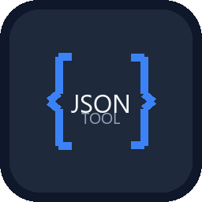

# JSON Tool

Windows 桌面 JSON 处理工具，基于 Python + customtkinter 构建。

<p align="center">
  
</p>

## 功能

- **格式化** — JSON 美化输出，4 空格缩进，支持嵌套字符串中的 JSON 递归格式化
- **压缩** — JSON 压缩为单行，去除多余空白
- **Unicode → 中文** — 将 `\uXXXX` 转义序列转为中文字符
- **中文 → Unicode** — 将中文字符转为 `\uXXXX` 转义序列
- **去除转义** — 移除反斜杠转义（`\n`、`\t`、`\"` 等）
- **添加转义** — 为特殊字符添加反斜杠转义

支持 4 种暗色主题：深蓝、暗紫、翠绿、珊瑚。

## 下载

前往 [Releases](https://github.com/ekingxu/JSONTool/releases) 下载最新版本的 `JSONTool.exe`，无需安装 Python 环境。

## 从源码运行

```bash
# 克隆仓库
git clone https://github.com/ekingxu/JSONTool.git
cd JSONTool

# 安装依赖
pip install -r requirements.txt

# 运行
python json_tool.py
```

## 打包为 EXE

```bash
python build.py
```

输出文件位于 `dist/JSONTool.exe`。

## 技术栈

- Python 3
- [customtkinter](https://github.com/TomSchimansky/CustomTkinter) — 现代化 tkinter UI 框架
- PyInstaller — 打包为独立可执行文件

## 许可证

MIT
